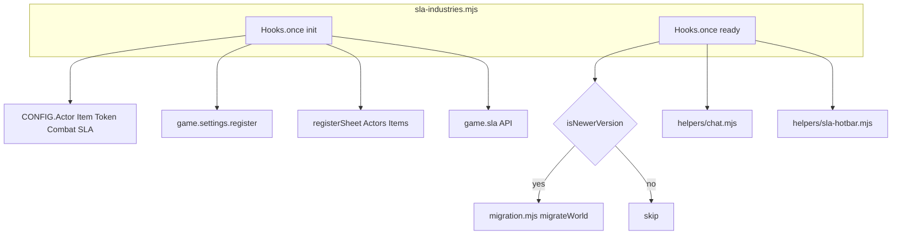
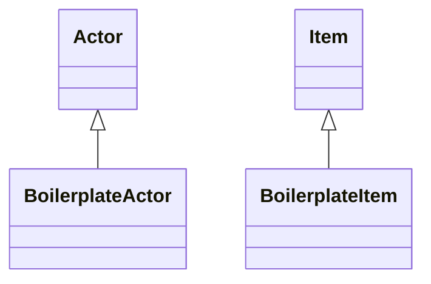
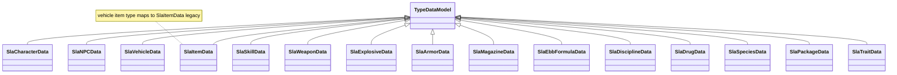
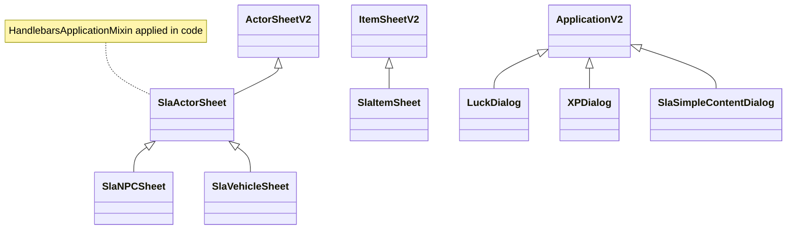
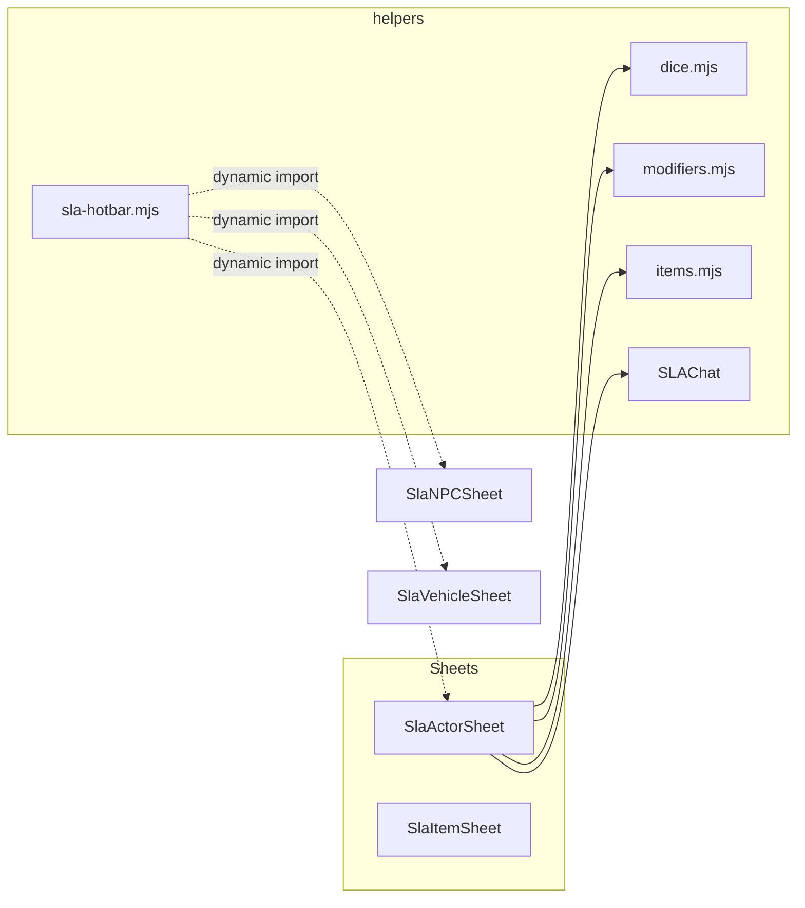

# SLA Industries — architecture and class hierarchy

This document maps the codebase under `module/` and how it connects to Foundry VTT. Foundry types (`Actor`, `Item`, `ActorSheetV2`, etc.) are **core** classes; SLA types are **local**.

## Runtime wiring (entry and CONFIG)

[`module/sla-industries.mjs`](module/sla-industries.mjs) is the sole ES module entry (`system.json` → `esmodules`).

- **`Hooks.once("init")`**: sets `CONFIG.SLA`, `CONFIG.Actor.documentClass` / `dataModels`, `CONFIG.Item.documentClass` / `dataModels`, `CONFIG.Token.rulerClass`, `CONFIG.Combat.initiative`, `CONFIG.statusEffects`, registers world settings, unregisters core sheets, registers SLA sheets, exposes `game.sla` (hotbar API), preloads Handlebars templates.
- **`Hooks.once("ready")`**: compares `systemMigrationVersion` to `CURRENT_MIGRATION_VERSION` in [`module/migration.mjs`](module/migration.mjs); runs `migrateWorld()` if newer; initializes [`module/helpers/chat.mjs`](module/helpers/chat.mjs) (`SLAChat`); registers hotbar hooks and stunned-initiative combat hook.

## Document classes (extend Foundry documents)

| Class | Extends | File |
|--------|---------|------|
| `BoilerplateActor` | `Actor` | [`module/documents/actor.mjs`](module/documents/actor.mjs) |
| `BoilerplateItem` | `Item` | [`module/documents/item.mjs`](module/documents/item.mjs) |

`BoilerplateActor` owns derived-stat logic (`prepareDerivedData`: wounds, encumbrance, conditions, species-linked behavior, etc.). `BoilerplateItem` implements `roll()` and item-specific roll paths.

## Type data models (`system` field per document subtype)

All extend **`foundry.abstract.TypeDataModel`**. They are registered on `CONFIG.Actor.dataModels` / `CONFIG.Item.dataModels` in `sla-industries.mjs`.

**Actor subtypes** ([`module/data/actor.mjs`](module/data/actor.mjs)):

- `SlaCharacterData` → `character`
- `SlaNPCData` → `npc`
- `SlaVehicleData` → `vehicle`

**Item subtypes** ([`module/data/item.mjs`](module/data/item.mjs)): `SlaItemData`, `SlaSkillData`, `SlaTraitData`, `SlaWeaponData`, `SlaExplosiveData`, `SlaArmorData`, `SlaEbbFormulaData`, `SlaDisciplineData`, `SlaDrugData`, `SlaSpeciesData`, `SlaPackageData`, `SlaMagazineData`, plus legacy item type `vehicle` → `SlaItemData`.

## Sheets and dialogs (Application V2 + mixin)

Foundry pattern: **`HandlebarsApplicationMixin(ApplicationV2)`** or **`HandlebarsApplicationMixin(ActorSheetV2)`** / **`ItemSheetV2`**. The mixin is applied in code, not as a separate named class in this repo.

| Class | Extends | File |
|--------|---------|------|
| `SlaActorSheet` | `HandlebarsApplicationMixin(ActorSheetV2)` | [`module/sheets/actor-sheet.mjs`](module/sheets/actor-sheet.mjs) |
| `SlaNPCSheet` | `SlaActorSheet` | [`module/sheets/actor-npc-sheet.mjs`](module/sheets/actor-npc-sheet.mjs) |
| `SlaVehicleSheet` | `SlaActorSheet` | [`module/sheets/actor-vehicle-sheet.mjs`](module/sheets/actor-vehicle-sheet.mjs) |
| `SlaItemSheet` | `HandlebarsApplicationMixin(ItemSheetV2)` | [`module/sheets/item-sheet.mjs`](module/sheets/item-sheet.mjs) |
| `LuckDialog` | `HandlebarsApplicationMixin(ApplicationV2)` | [`module/apps/luck-dialog.mjs`](module/apps/luck-dialog.mjs) |
| `XPDialog` | `HandlebarsApplicationMixin(ApplicationV2)` | [`module/apps/xp-dialog.mjs`](module/apps/xp-dialog.mjs) |
| `SlaSimpleContentDialog` | `HandlebarsApplicationMixin(ApplicationV2)` | [`module/apps/sla-simple-dialog.mjs`](module/apps/sla-simple-dialog.mjs) |

## Canvas override

| Class | Extends | File |
|--------|---------|------|
| `SLATokenRuler` | `foundry.canvas.placeables.tokens.TokenRuler` | [`module/canvas/sla-ruler.mjs`](module/canvas/sla-ruler.mjs) |

Registered as `CONFIG.Token.rulerClass`.

## Helpers and cross-cutting modules

- [`module/helpers/dice.mjs`](module/helpers/dice.mjs) — SLA roll construction; used heavily by actor sheet and item flows.
- [`module/helpers/modifiers.mjs`](module/helpers/modifiers.mjs) — melee/ranged modifiers.
- [`module/helpers/items.mjs`](module/helpers/items.mjs) — `prepareItems` for sheet context.
- [`module/helpers/chat.mjs`](module/helpers/chat.mjs) — `SLAChat` static class: chat message HTML hooks, damage application.
- [`module/helpers/sla-hotbar.mjs`](module/helpers/sla-hotbar.mjs) — `rollOwnedItem`, macro creation; dynamic-imports sheets to avoid cycles.
- [`module/helpers/templates.mjs`](module/helpers/templates.mjs) — Handlebars preload list.
- [`module/helpers/drop-handlers.mjs`](module/helpers/drop-handlers.mjs) — drag/drop utilities for item sheet.
- [`module/config.mjs`](module/config.mjs) — `SLA` constant object (combat skills, status effects, initiative, etc.).
- [`module/migration.mjs`](module/migration.mjs) — world migration + optional JSON backup download; calls [`scripts/migrate_stat_damage.js`](../scripts/migrate_stat_damage.js) for natural weapons.

## Further reading

- Foundry development docs: [https://foundryvtt.wiki/en/development](https://foundryvtt.wiki/en/development)
- Public API (v14): [https://foundryvtt.com/api/v14/](https://foundryvtt.com/api/v14/)
